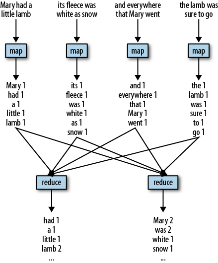
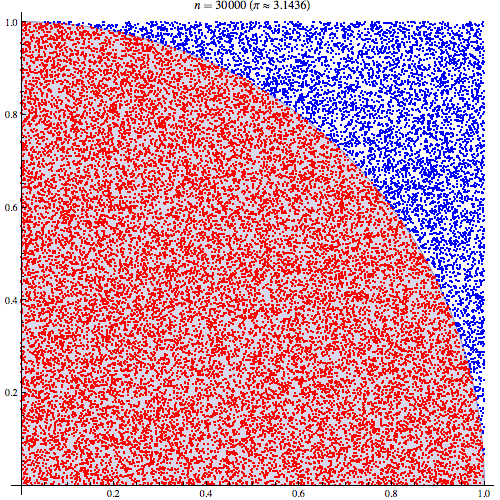

# Hadoop and Spark

## 1. What is Hadoop?
Hadoop is a *distributed file system* created by Apache Software Foundation (a not-for-profit open-source software provider) that allows for efficient processing of big data sets by distributing data processing computations across a cluster of computers.

Hadoop was created to be 

- **open source**
- **scalable**
- **fault tolerant**

The Hadoop framework is comprised of the following elements:

- *Hadoop Common* -- the base set of libraries
- *Hadoop Distributed File System (HDFS)* -- file system that stores data on many machines
- *Hadoop YARN* -- resource manager for Hadoop jobs ("YARN" stands for "Yet Another Resource Negotiator")
- *Hadoop MapReduce* -- an implementation of the MapReduce programming model for large-scale data processing

### 1.1 What is MapReduce?
"MapReduce" is a general programming model for distributing complex or intensive computations across multiple machines.

The main workflow of the MapReduce model is:

1. Split -- divide your huge dataset into K chunks, where K is the number of machines you'll run it on
2. Map -- apply some function (in parallel) to each of the chunked-up datasets (e.g. count words)
    * Other functions such as shuffling and sorting may also take place in the "map" phase 
3. Reduce -- reduce the number of chunks in the dataset by combining chunks either by merging the datasets back together, or performing some other aggregating operation (like addition or averaging)

 The following images hopefully illustrate the concept:




### 1.2 Other Apache products
In addition to the above four elements of the Hadoop framework, Apache has continued to create higher-level programs for a more tailored Big Data experience. The most common of these are:

- Pig -- a SQL-style language for MapReduce tasks (think of it as a SQL-style shell scripting language for MapReduce)
- Hive -- a SQL-style interface to query data stored in the HDFS
- Spark -- an innovation on Hadoop MapReduce that relaxes some constraints on how MapReduce jobs must be structured

All of the Apache products work in the HDFS environment.

**Trivia:** Hadoop was created in 2006 following the original MapReduce programming model and the original Google File System, both of which were created by Google in the early 2000s.

## 2. What is Spark?
Spark was released in 2010 as a generalization of the MapReduce concept for HDFS. Essentially, the creators of Spark wanted to allow for more types of operations to fit into the MapReduce model.

Spark represents innovations over Hadoop in the following ways:

* faster
* consumes fewer resources
* includes APIs to interface with common programming languages
* simplified user experience
* interface with Machine Learning libraries
* handling of streamed data (e.g. twitter, Fb timelines which are continuously generated)
* includes an interactive prompt (in Scala)

Spark does all this while also satisfying the primary goals of Hadoop (open source, scalable, and fault tolerant).

Spark's API has been developed for the following languages:

* R (SparkR, sparklyr)
* Python (PySpark)
* Julia (Spark.jl)
* SQL (spark-sql)
* Java
* Scala

Many of these are included on the OSCER computing cluster and can be run interactively.

### 2.1 RDDs
RDDs (Resilient Distributed Datasets) are the fundamental units of data in Spark.

RDDs can be created in three ways:

1. By creating a parallelized collection
2. By converting a CSV, JSON, TSV, etc. to an RDD
3. By applying a transformation operation to an existing RDD

RDDs are immutable, meaning they cannot be modified. This turns out to be a highly efficient way of organizing computing operations, both in terms of minimizing computational burden and in terms of maintaining fault tolerance.

But if RDDs can't be modified, how can we apply functions to them? There are two (non-mututally-exclusive) ways:

1. Transformation -- we create a new RDD which is a copy of the previous RDD, but with the new operation applied
    * e.g. `map`
    * e.g. returning unique values of the source dataset
    * e.g. sorting by a key
2. Action -- we return some final result (either to the node we originated from, or to an external file)
    * e.g. `reduce`
    * e.g. returning the first `n` elements of the dataset
    * e.g. returning a random sample of the dataset

### 2.2 Examples:

#### 2.2.1 Counting word instances in Jane Austen's *Pride & Prejudice*

* We'll walk through an example on OSCER that uses Java to call Hadoop and count instances of every word in *Pride & Prejudice* using 20 nodes and output the result to a text file.

#### 2.2.2 Using Monte Carlo simulation to compute pi



We can derive pi by drawing pairs of random numbers between 0 and 1 and counting what fraction of them are less than or equal to the curve `x^2 + y^2 = 1`. 

Then, because we know that the area of a circle is `pi*radius^2`, and we know that the radius of `x^2 + y^2 = 1` is 1, we can multiply the area we computed by 4 (since our random numbers only fall in the 1st Quadrant) to get an estimate of pi. 

The code below does this in Python using `PySpark`.

```python
from __future__ import print_function

import sys
from random import random
from operator import add

from pyspark.sql import SparkSession


if __name__ == "__main__":
    """
        Usage: pi [partitions]
    """
    spark = SparkSession\
        .builder\
        .appName("PythonPi")\
        .getOrCreate()

    partitions = int(sys.argv[1]) if len(sys.argv) > 1 else 2
    n = 100000 * partitions

    def f(_):
        x = random() * 2 - 1
        y = random() * 2 - 1
        return 1 if x ** 2 + y ** 2 <= 1 else 0

    count = spark.sparkContext.parallelize(range(1, n + 1), partitions).map(f).reduce(add)
    print("Pi is roughly %f" % (4.0 * count / n))

    spark.stop()
```


# Useful links

* [Quora: Hadoop vs. Spark](https://www.quora.com/What-is-the-difference-between-Hadoop-and-Spark)
* [Spark basics](https://data-flair.training/blogs/what-is-spark/)
* [Spark workshop slides](https://stanford.edu/~rezab/sparkclass/slides/itas_workshop.pdf)
* [Hadoop wikipedia page](https://en.wikipedia.org/wiki/Apache_Hadoop)
* [MapReduce wikipedia page](https://en.wikipedia.org/wiki/MapReduce)
* [SparkR demo](https://rpubs.com/wendyu/sparkr)
