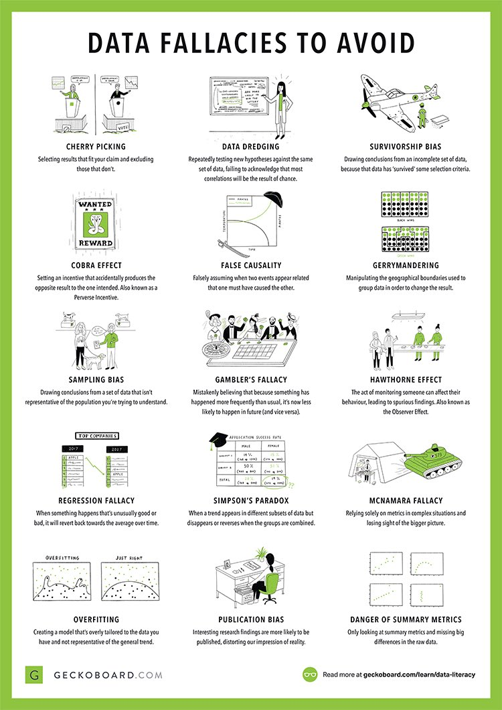

# Structural Economics
The last part of our course will focus on how we can combine the tools of economic theory, econometrics, and machine learning to build better empirical economic models. Much of the content of this session comes from various lectures given by [Susan Athey](https://www.gsb.stanford.edu/faculty-research/faculty/susan-athey), who is an economics professor at Stanford and who is the foremost expert in these matters. A nice podcast on the topic is available [here (11/16/2012 episode)](https://itunes.apple.com/us/podcast/uw-cse-colloquia-university-washington-computer-science/id431501588?mt=2&i=1000124767619).

First, we'll talk about the main ways in which econometrics and machine learning differ. We've covered some of this in prior discussions this semseter, but it helps to lay out exactly what the strengths of limitations of each approach is, so that we know what the comparative advantage is of each.

## Data Fallacies
Before doing that, let's briefly discuss the following Data Fallacies (which I recently came across on [twitter](https://twitter.com/KirkDBorne/status/981390062540808193), full content available [here](https://www.geckoboard.com/learn/data-literacy/statistical-fallacies/#.Ws0BvOgbNmM), download a [PDF](https://www.geckoboard.com/assets/data-fallacies-to-avoid.pdf) of the image below).

Which fallacies is machine learning good at addressing? Which fallacies is econometrics good at addressing?

### Types of variables and types of data
In social science and business settings, we are typically interested in understanding various phenomena.
* Will changing the layout of our website increase our company's revenue? By how much?
* If eBay changes its auction format, will it generate more profit?
* If our sports team changes its defensive scheme, will that increase our likelihood of winning the game?

There are typically three __types of variables__ available to us in any kind of data set:
1. Outcome variable
    * It is the variable we are trying to explain (sales, revenue, profit, criminal activity, earnings, etc.)
2. Treatment variable
    * It is a variable that can be changed by a policymaker to affect outcomes (website layout, auction format, play calling, prison sentencing laws, etc.)
3. Control variables
    * These are variables that explain outcomes, but that cannot be changed by a policymaker (e.g. opponent characteristics, demographic variables, longstanding cultural traditions, etc.)

Whether your data set is big or small, there are three main __types of data sets__:
1. Observational data
    * Data is collected without any attempt to modify the treatment variable. We see the world "as it is." All variation in the treatment variable is non-random.
2. Quasi-experimental data
    * Observational data, but where we observe some additional variables that are randomly (or as-if randomly) assigned, but not by the data collector.
3. Experimental data
    * Data collected where data collector personally manipulates the treatment variable(s). In a *randomized experiment*, units of observation are randomly assigned to various levels of treatment.

How ubiquitous are the three types of data?

* __Observational data__ is by far the most common type of data. Why? because it's much easier to collect---we simply need to measure the variables we're interested in. Furthermore, observational data can be used for many different purposes.
* __Quasi-experimental data__ is the next most common type. This is observational data, but restricted to instances where there are some randomly or quasi-randomly assigned variable(s) available.
* __Experimental data__ is least common, simply because it costs money to run an experiment, and typically the experiment is used to analyze a specific question, and can't easily be used to answer other questions

## Econometrics vs. Machine Learning
Now that we have a sense for the various data fallacies and types of data, we can talk about in what ways econometrics and machine learning  are fundamentally different, and how the two can be combined to improve the broadly defined goals of data science.

### Goal of econometrics
The goal of econometrics is to make counterfactual predictions. 
- What *would happen* to the price of high-speed internet if Comcast and Time Warner were to be allowed to merge? 
- What *would happen* to Amazon's profits if it changed its website layout? 
- What *would happen* to crime rates if prison sentences for all crimes were suddenly reduced?

We don't get to observe the world under these alternative policies, so we can't simply find the answers in the data. Knowing the counterfactual requires being able to measure a causal effect. (In previous lectures we've reduced this to saying "the goal of econometrics is to find &beta; hat" where here we mean &beta; hat to be the causal impact of X on y.) Being able to measure a causal effect requires making assumptions. That's what economics is all about!

__Ways to measure causal effects__

Econometric methods were designed to measure causal effects under varying degrees of difficulty (i.e. measuring causality using  experimental data is much easier than measuring it using observational data). Broadly speaking, there are three different ways to do so:

1. Field experiments (i.e. collect experimental data)
    * Causal effects immediately visible due to experimental design
2. "Reduced form" methods using quasi-experimental or observational data
    * These methods include instrumental variables, regression discontinuity, and difference-in-differences (among others)
    * The goal is to separate "good" variation (i.e. randomness in the instrument or randomness in the cutoff) from "bad" variation (non-random variation in treatment)
3. Structural models using observational data
    * Make assumptions (e.g. profit maximization, rational decision-making)
    * Estimate primitives of an economic model (e.g. costs, consumer preferences, production technology)
    * Use the estimated primitives to predict what would happen under a counterfactual scenario

### Goal of machine learning
In contrast, the goal of machine learning is to come up with the best possible out-of-sample prediction.

* To get this prediction, a lot of effort is spent on validating many possible models.
* However, if the world changes in a fundamental way, the trained predictive model is no longer useful

