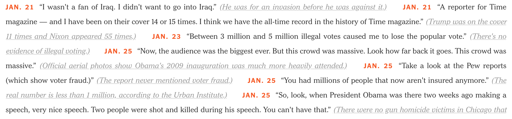

The following is a R notebook of a Medium [blog post](https://towardsdatascience.com/web-scraping-tutorial-in-r-5e71fd107f32) from August 2, 2017 by José Roberto Ayala Solares. The following is a direct quote from his blog; I omit quotation markings for ease of interface.

A couple of days ago, [Kevin Markham](https://twitter.com/justmarkham?lang=en) from [Data School](http://www.dataschool.io/), published a nice [tutorial](http://www.dataschool.io/python-web-scraping-of-president-trumps-lies/) about web scraping using 16 lines of Python code.

The tutorial is simple and really well-made. I strongly encourage you to have a look at it. In fact, such a tutorial motivated me to replicate the results but this time using R. With Kevin's permission, I'll use a similar layout as his blog post. Also, I'll use the same website about an opinion article called [Trump's Lies](https://www.nytimes.com/interactive/2017/06/23/opinion/trumps-lies.html). This should facilitate any comparison between the two approaches.

## Examining the New York Times Article
For a nice description about the article that we'll be working with, I encourage you to have a look at Kevin's [tutorial](http://www.dataschool.io/python-web-scraping-of-president-trumps-lies/). In summary, the data that we are interested in consists of a record of lies, each with 4 parts:

- The date of the lie
- The lie itself
- An explanation of why it was a lie
- A URL for an article that supports the explanation (embedded within the text)



## Reading the web page into R
To read the web page into R, we can use the [rvest](https://cran.r-project.org/web/packages/rvest/rvest.pdf) package, made by the R guru [Hadley Wickham](https://twitter.com/hadleywickham). This package is inspired by libraries like [Beautiful Soup](https://www.crummy.com/software/BeautifulSoup/), to make it easy to scrape data from html web pages. The first important function to use is `read_html()`, which returns an [XML](https://en.wikipedia.org/wiki/XML) document that contains all the information about the web page.

```{r}
library(rvest)
webpage <- read_html("https://www.nytimes.com/interactive/2017/06/23/opinion/trumps-lies.html")
webpage
#> {xml_document}
#> <html lang="en" class="no-js page-interactive section-opinion page-theme-standard tone-opinion page-interactive-default  limit-small layout-xlarge app-interactive" itemid="https://www.nytimes.com/interactive/2017/06/23/opinion/trumps-lies.html" itemtype="http://schema.org/NewsArticle" itemscope="" xmlns:og="http://opengraphprotocol.org/schema/">
#> [1] <head>\n<meta http-equiv="Content-Type" content="text/html; charset=UTF-8">\n<title>President Trump's L ...
#> [2] <body>\n    \n    <style>\n    .lt-ie10 .messenger.suggestions {\n        display: block !important;\n  ...
```

## Collecting all of the records
As explained in Kevin's tutorial, every record has the following structure in the HTML code:

`<span class="short-desc"><strong> DATE </strong> LIE <span class="short-truth"><a href="URL"> EXPLANATION </a></span></span>`

Therefore, to collect all the lies, we need to identify all the `<span>` tags that belong to `class="short-desc"`. The function that will help us to do so is `html_nodes()`. This function requires the XML document that we have read and the nodes that we want to select. For the later, it is encouraged to use the [SelectorGadget](http://selectorgadget.com/), an open source tool that makes CSS selector generation and discovery easy. Using such a tool, we find that all the lies can be selected by using the selector `".short-desc"`.

```{r}
results <- webpage %>% html_nodes(".short-desc")
results
#> {xml_nodeset (116)}
#> [1] <span class="short-desc"><strong>Jan. 21 </strong>"I wasn't a fan of Iraq. I didn't want to go into Ir ...
#> [2] <span class="short-desc"><strong>Jan. 21 </strong>"A reporter for Time magazine — and I have been on t ...
#> [3] <span class="short-desc"><strong>Jan. 23 </strong>"Between 3 million and 5 million illegal votes cause ...
#> [4] <span class="short-desc"><strong>Jan. 25 </strong>"Now, the audience was the biggest ever. But this cr ...
#> [5] <span class="short-desc"><strong>Jan. 25 </strong>"Take a look at the Pew reports (which show voter fr ...
#> [6] <span class="short-desc"><strong>Jan. 25 </strong>"You had millions of people that now aren't insured  ...
#> [7] <span class="short-desc"><strong>Jan. 25 </strong>"So, look, when President Obama was there two weeks  ...
#> [8] <span class="short-desc"><strong>Jan. 26 </strong>"We've taken in tens of thousands of people. We know ...
#> ...
```

This returns a list with 116 XML nodes that contain the information for each of the 116 lies in the web page.

Notice that I am using the `%>%` pipe-operator from the [magrittr](http://magrittr.tidyverse.org/) package, which can help to express complex operations as elegant pipelines composed of simple, easily understood pieces.

## Extracing the date
Let's start simple and focus on extracting all the necessary details from the first lie. We can then extend this to all the others easily. Remember that the general structure for a single record is:

`<span class="short-desc"><strong> DATE </strong> LIE <span class="short-truth"><a href="URL"> EXPLANATION </a></span></span>`

Notice that the date is embedded within the `<strong>` tag. To select it, we can use the `html_nodes()` function using the selector `"strong"`.

```{r}
first_result <- results[1]
first_result %>% html_nodes("strong")
#> {xml_nodeset (1)}
#> [1] <strong>Jan. 21 </strong>
```

We then need to use the `html_text()` function to extract only the text, with the trim argument active to trim leading and trailing spaces. Finally, we make use of the [stringr](http://stringr.tidyverse.org/) package to add the year to the extracted date.

## Extracting the lie
To select the lie, we need to make use of the `xml_contents()` function that is part of the xml2 package (this package is required by the rvest package, so it is not necessary to load it). The function returns a list with the nodes that are part of `first_result`.

```{r}
xml_contents(first_result)
#> {xml_nodeset (3)}
#> [1] <strong>Jan. 21 </strong>
#> [2] "I wasn't a fan of Iraq. I didn't want to go into Iraq." 
#> [3] <span class="short-truth"><a href="https://www.buzzfeed.com/andrewkaczynski/in-2002-don ...
```

We are interested in the lie, which is the text of the second node.

```{r}
xml_contents(first_result)[2] %>% html_text(trim = TRUE)
#> [1] ""I wasn't a fan of Iraq. I didn't want to go into Iraq.""
```

Notice that there is an extra pair of quotes ("…") surrounding the lie. To get rid of them, we simply use the `str_sub()` function from the stringr package to select just the lie.

```{r}
lie <- xml_contents(first_result)[2] %>% html_text(trim = TRUE)
str_sub(lie, 2, -2)
#> [1] "I wasn't a fan of Iraq. I didn't want to go into Iraq."
```

## Extracting the explanation
Hopefully by now it shouldn't be too complicated to see that to extract the explanation we simply need to select the text within the `<span>` tag that belongs to `class=".short-truth"`. This will extract the text together with the opening and closing parentheses, but we can easily get rid of them.

```{r}
explanation <- first_result %>% html_node(".short-truth") %>% html_text(trim = TRUE)
str_sub(explanation, 2, -2)
#> [1] "He was for an invasion before he was against it."
```

## Extracting the URL
Finally, to get the URL, notice that this is an attribute within the `<a>` tag. We simply select this node with the `html_nodes()` function, and then select the href attribute with the `html_attr()` function.

```{r}
url <- first_result %>% html_node("a") %>% html_attr("href")
url
#> [1] "https://www.buzzfeed.com/andrewkaczynski/in-2002-donald-trump-said-he-supported-invading-iraq-on-the"
```

## Building the dataset
We found a way to extract each of the 4 parts of the first record. We can extend this process to all the rest using a for loop. In the end, we want to have a data frame with 116 rows (one for each record) and 4 columns (to keep the date, the lie, the explanation and the URL). One way to do so is to create an empty data frame and simply add a new row as each new record is processed. However, this is not considered a good practice. As suggested [here](http://r4ds.had.co.nz/iteration.html#unknown-output-length), we are going to create a single data frame for each record and store all of them in a list. Once we have the 116 data frames, we'll bind them together using the `bind_rows()` function from the [dplyr](http://dplyr.tidyverse.org/) package. This creates our desired dataset.

```{r}
library(dplyr)
records <- vector("list", length = length(results))

for (i in seq_along(results)) {
    date <- str_c(results[i] %>% html_nodes("strong") %>% html_text(trim = TRUE), ", 2017")
    lie <- str_sub(xml_contents(results[i])[2] %>% html_text(trim = TRUE), 2, -2)
    explanation <- str_sub(results[i] %>% html_nodes(".short-truth") %>% html_text(trim = TRUE), 2, -2)
    url <- results[i] %>% html_nodes("a") %>% html_attr("href")
    records[[i]] <- data_frame(date = date, lie = lie, explanation = explanation, url = url)
}

df <- bind_rows(records)
glimpse(df)
#> Observations: 116
#> Variables: 4
#> $ date        <chr> "Jan. 21, 2017", "Jan. 21, 2017", "Jan. 23, 2017", "Jan. 25, 2017", "...
#> $ lie         <chr> "I wasn't a fan of Iraq. I didn't want to go into Iraq.", "A reporter...
#> $ explanation <chr> "He was for an invasion before he was against it.", "Trump was on the...
#> $ url         <chr> "https://www.buzzfeed.com/andrewkaczynski/in-2002-donald-trump-said-h...
```

Notice that the column for the date is considered a character vector. It'd be nice to have it as a datetime vector instead. To do so, we can use the lubridate package and use the `mdy()` function (month-day-year) to make the conversion.

```{r}
library(lubridate)
df$date <- mdy(df$date)
glimpse(df)
#> Observations: 116
#> Variables: 4
#> $ date        <date> 2017-01-21, 2017-01-21, 2017-01-23, 2017-01-25, 2017-01-25, 2017-01-...
#> $ lie         <chr> "I wasn't a fan of Iraq. I didn't want to go into Iraq.", "A reporter...
#> $ explanation <chr> "He was for an invasion before he was against it.", "Trump was on the...
#> $ url         <chr> "https://www.buzzfeed.com/andrewkaczynski/in-2002-donald-trump-said-h...
```

## Exporting the dataset to a CSV file
If you want to export your dataset, you can use either the `write.csv()` function that comes by default with R, or the `write_csv()` function from the [readr](http://readr.tidyverse.org/) package, which is twice faster and more convenient than the first one.

```{r}
write_csv(df, "trump_lies.csv")
```

Similarly, to retrieve your dataset, you can use either the default function `read.csv()` or the `read_csv()` function from the [readr](http://readr.tidyverse.org/) package.

```{r}
df <- read_csv("trump_lies.csv")
#> Parsed with column specification:
#> cols(
#>   date = col_date(format = ""),
#>   lie = col_character(),
#>   explanation = col_character(),
#>   url = col_character()
#> )
```

## Summary
The full code for this tutorial is shown below:

```{r}
# Load packages
library(rvest)
library(stringr)
library(dplyr)
library(lubridate)
library(readr)

# Read web page
webpage <- read_html("https://www.nytimes.com/interactive/2017/06/23/opinion/trumps-lies.html")

# Extract records info
results <- webpage %>% html_nodes(".short-desc")

# Building the dataset
records <- vector("list", length = length(results))

for (i in seq_along(results)) {
    date <- str_c(results[i] %>% 
                      html_nodes("strong") %>% 
                      html_text(trim = TRUE), ', 2017')
    lie <- str_sub(xml_contents(results[i])[2] %>% html_text(trim = TRUE), 2, -2)
    explanation <- str_sub(results[i] %>% 
                               html_nodes(".short-truth") %>% 
                               html_text(trim = TRUE), 2, -2)
    url <- results[i] %>% html_nodes("a") %>% html_attr("href")
    records[[i]] <- data_frame(date = date, lie = lie, explanation = explanation, url = url)
}

df <- bind_rows(records)

# Transform to datetime format
df$date <- mdy(df$date)

# Export to csv
write_csv(df, "trump_lies.csv")
```

I also want to mention that the stringr, dplyr, lubridate and readr packages are all part of the [tidyverse](http://tidyverse.org/) family. This is a collection of R packages that are designed to work together to make the [data analysis process](http://r4ds.had.co.nz/introduction.html#what-you-will-learn) easier. In fact, you could also use the popular [purrr](http://purrr.tidyverse.org/) package to avoid the for loop. However, this would require the creation of a function that maps each record to a data frame. For another example on how to do web scraping, have a look at this awesome [blog post](http://deanattali.com/blog/user2017/) from [Dean Attali](https://twitter.com/daattali).

Hopefully you find this tutorial useful. Its purpose is not to show which programming language is better, but instead to learn from both Python and R, as well as to increase your programming skills and tools to tackle a more diverse set of problems.
